# 🧩 Sudoku Solver Game

<div align="center">


A fully-featured **Java-based Sudoku game** with automatic puzzle generation, recursive backtracking solver, performance analytics dashboard, achievement system, game history comparison, and much more — built with clean Object-Oriented Architecture.

</div>

---

## ✨ Features

### 🎮 Core Game
- **Interactive GUI Board** — playable 9×9 Sudoku with real-time feedback
- **3 Difficulty Levels** — Easy (25 removals), Medium (45), Hard (57)
- **Auto Solver** — recursive backtracking solves any puzzle instantly
- **Hint System** — reveals correct value for any selected cell
- **Mistake Detection** — highlights incorrect entries in red
- **Timer** — tracks time taken to solve each puzzle
- **Reset Board** — clears user input while preserving original puzzle

### 📊 Performance & Analytics
- **Performance Dashboard** — completion time, accuracy rate, efficiency score
- **Performance Visualization** — circular score chart with detailed breakdown
- **Interactive Charts** — hints, mistakes, time & accuracy bar charts
- **Advanced Statistics** — mean/median accuracy, standard deviation, trend slope
- **Game History Comparison** — compare current vs previous games side by side

### 🏆 Achievements & Progress
- **Achievement System** — Diamond, Gold, Platinum, Bronze tiers
  - ⭐ Perfect Game · ⚡ Speed Demon · 🎯 Accuracy Master · 🧠 Hintless Hero
- **Practice Mode** — targeted practice based on your performance stats
- **Generate Report** — save detailed performance report as PDF/TXT
- **Share Results** — share your score summary

---

## 🏗️ Project Architecture

```
SudokuGame/
├── SudokuBoard.java      # Core board state management
├── SudokuSolver.java     # Recursive backtracking solver & hint engine
├── PuzzleGenerator.java  # Random puzzle generation with difficulty control
├── SudokuGUI.java        # Main game interface & user interaction
└── finalWindow.java      # Performance dashboard & result display
```

---

## 🧠 How the Solver Works

```
1. Find next empty cell
2. Try numbers 1–9
3. Check validity (row, column, 3×3 box)
4. If valid → place number → recurse
5. If stuck → backtrack → try next number
6. Repeat until board is complete
```

---

## 📸 Screenshots

### 🎮 Game Board

| Empty Board | Easy Puzzle | Medium Puzzle | Hard Puzzle |
|:---:|:---:|:---:|:---:|
| 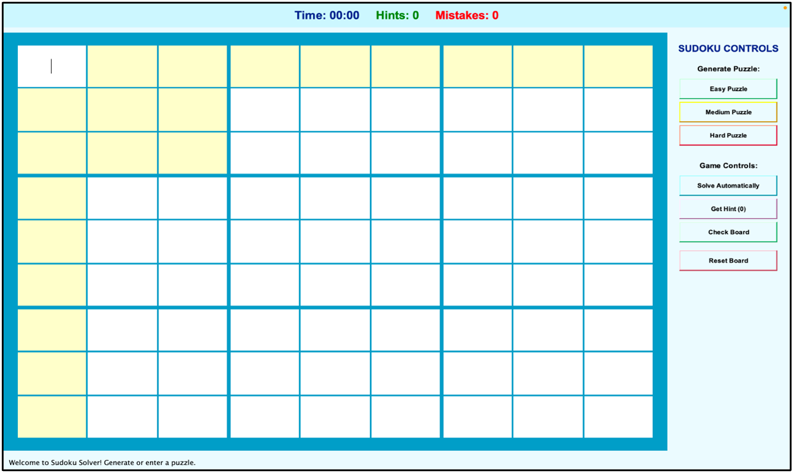 | 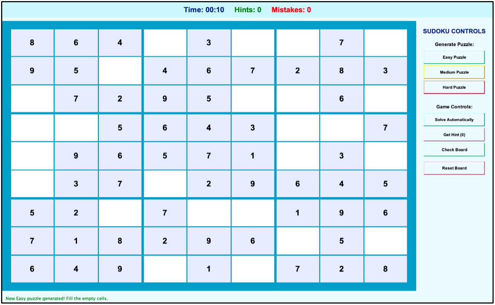 | 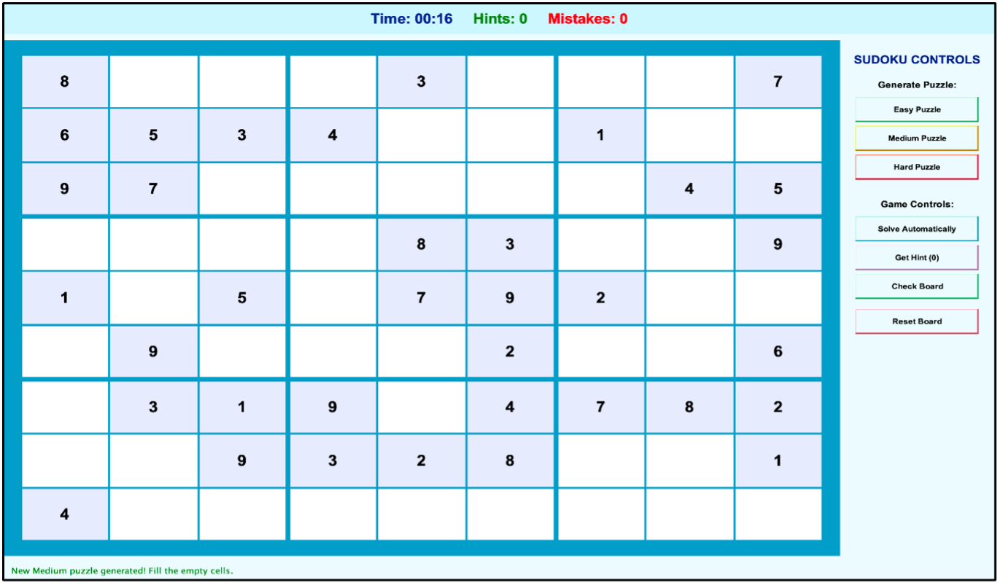 | 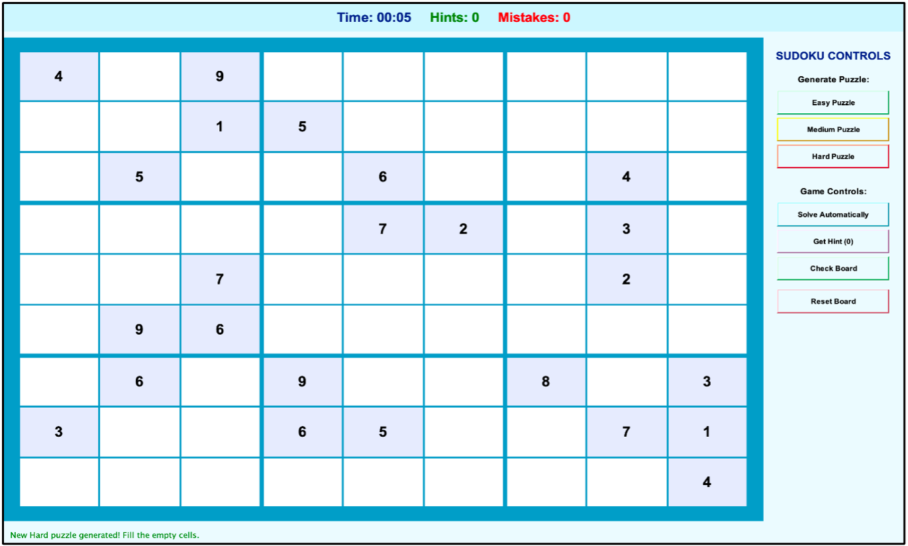 |

### 💡 Gameplay Features

| Hint | Mistake | Auto Solved |
|:---:|:---:|:---:|
| 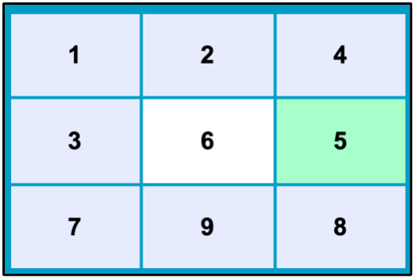 | 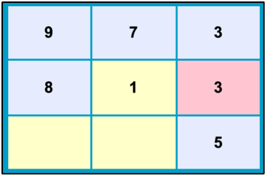 | 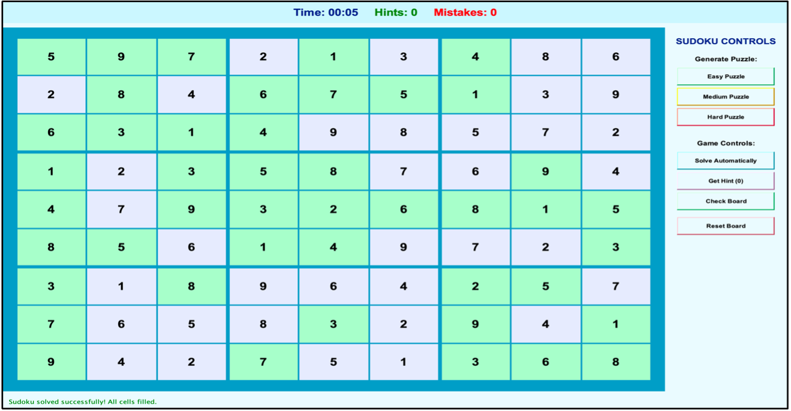 |

### 📊 Performance Dashboard

| KPI Overview | Performance Visualization | Interactive Charts |
|:---:|:---:|:---:|
| 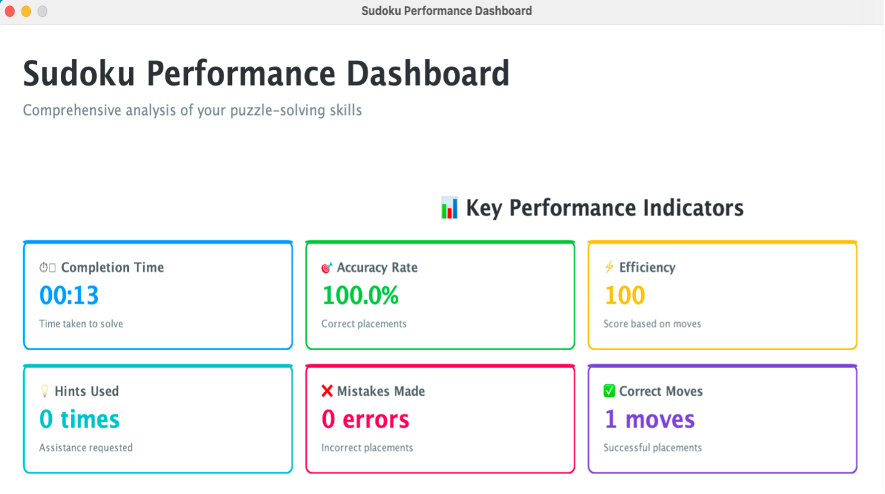 | 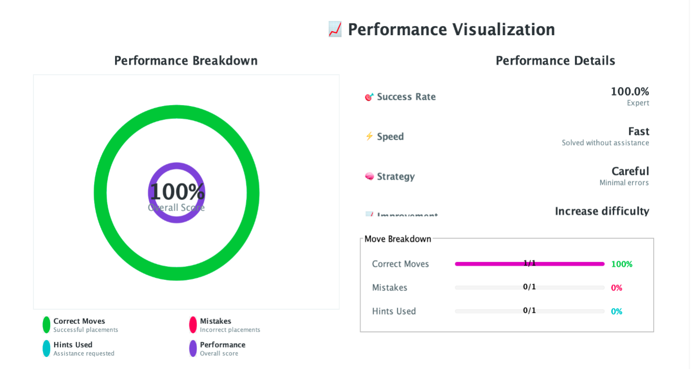 | 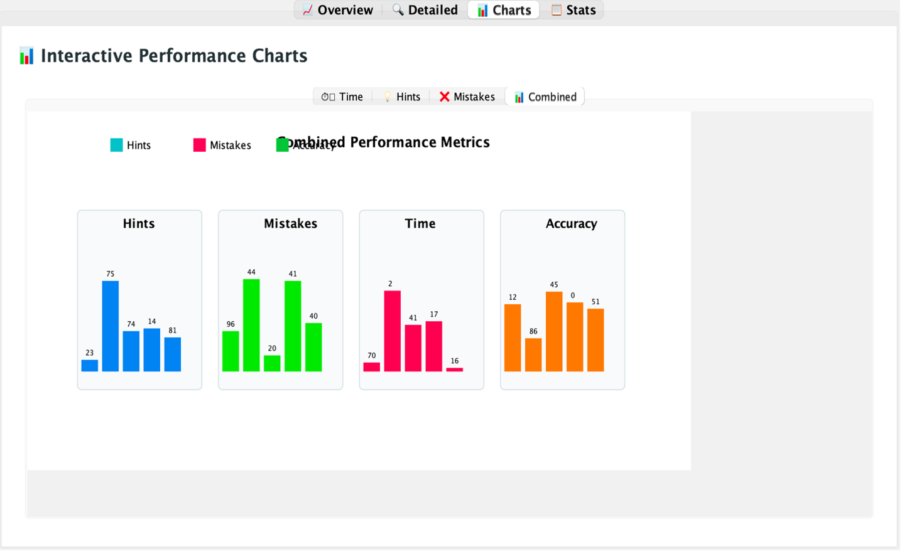 |

### 🏆 Game History & Stats

| Overview | Detailed Comparison | Advanced Stats |
|:---:|:---:|:---:|
| 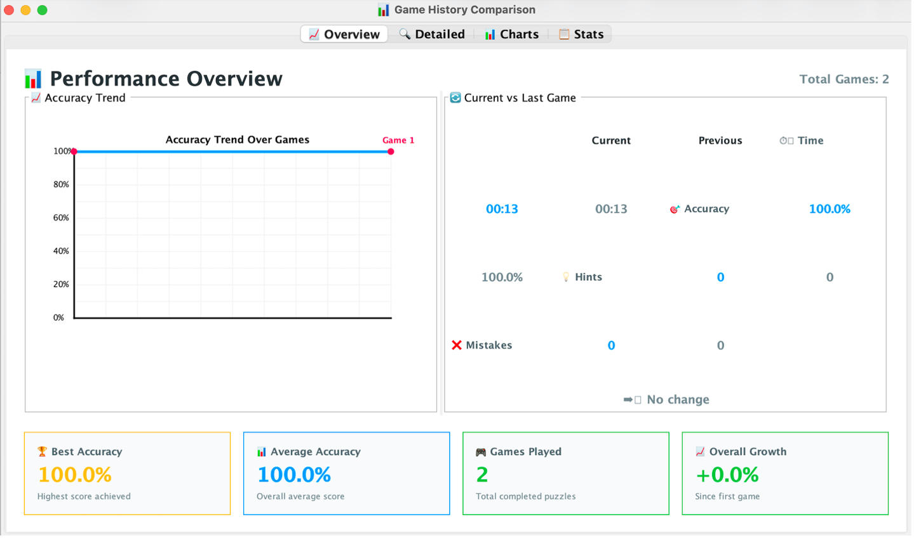 | 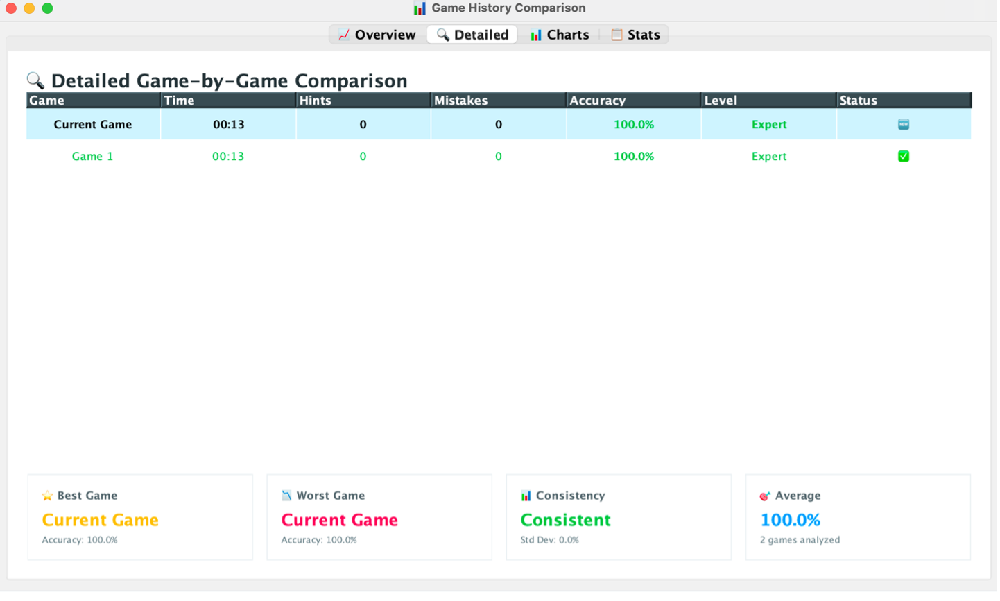 | 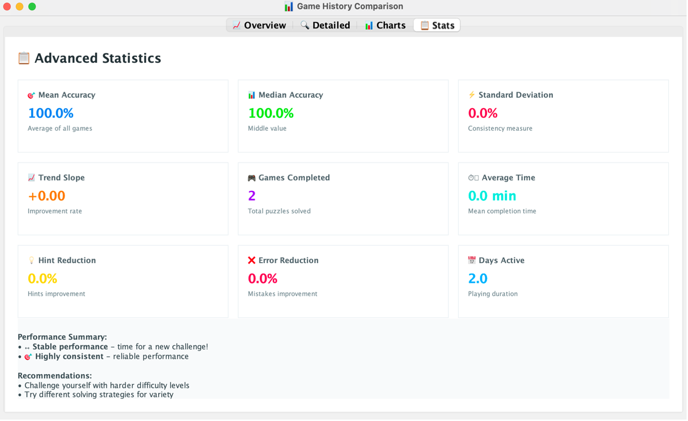 |

### 🎖️ Extra Features

| Achievements | Practice Mode | Share Results | Generate Report |
|:---:|:---:|:---:|:---:|
| 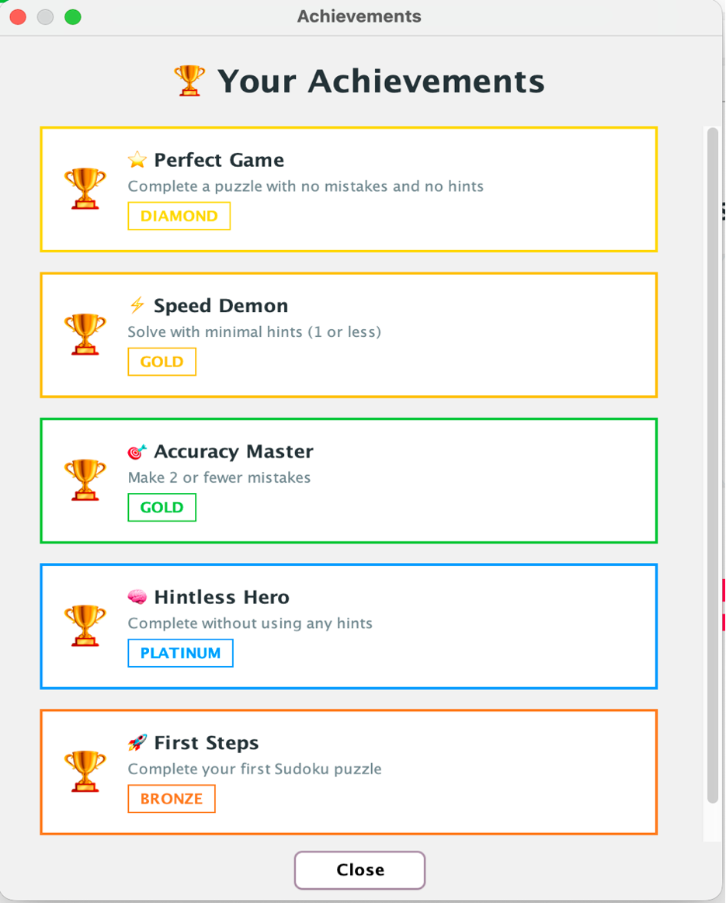 | 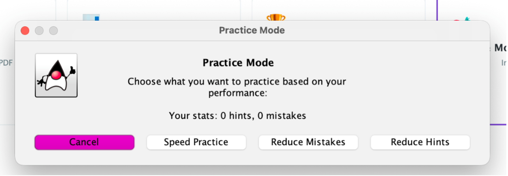 | 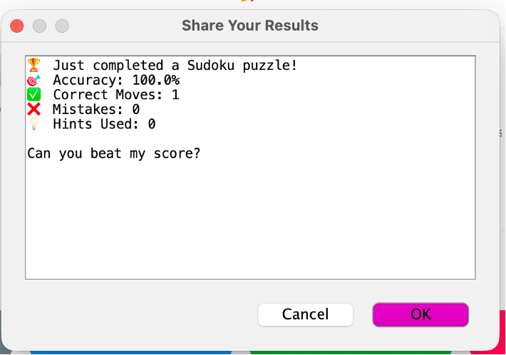 | 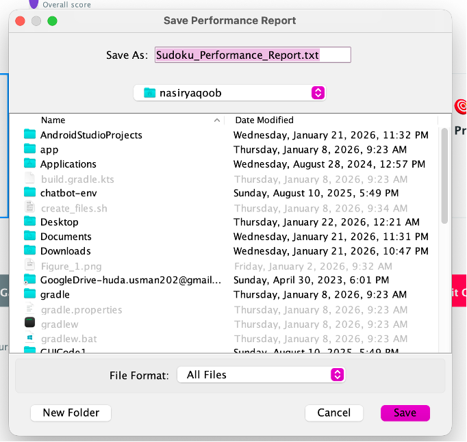 |

---

## 🚀 Getting Started

### Prerequisites
- Java JDK 8 or higher

### Run the Game

```bash
# Clone the repository
git clone https://github.com/huda-usman/sudoku-solver-game.git

# Navigate to project
cd sudoku-solver-game

# Compile
javac *.java

# Run
java SudokuGUI
```

---

## 📁 Screenshot Naming Guide

Rename your screenshots and place them inside a `screenshots/` folder:

| File Name | Description |
|---|---|
| `01_game_board.png` | Empty game board |
| `02_easy_board.png` | Easy puzzle generated |
| `03_medium_board.png` | Medium puzzle generated |
| `04_hard_board.png` | Hard puzzle generated |
| `05_hint.png` | Hint highlighted in green |
| `06_mistake.png` | Mistake highlighted in red |
| `07_solve_automatically.png` | Board solved automatically |
| `08_performance_dashboard.png` | KPI performance dashboard |
| `09_performance_visualization.png` | Circular score visualization |
| `10_additional_features.png` | Additional features screen |
| `11_generate_report.png` | Save performance report dialog |
| `12_compare_games_overview.png` | Game history overview |
| `13_compare_games_detailed.png` | Detailed game comparison |
| `14_compare_games_stats.png` | Advanced statistics |
| `15_compare_games_charts.png` | Interactive performance charts |
| `16_achievements.png` | Achievements screen |
| `17_practice_mode.png` | Practice mode dialog |
| `18_share_results.png` | Share results dialog |

---

## 👩‍💻 Author

**Huda Usman** — [github.com/huda-usman](https://github.com/huda-usman) · [LinkedIn](https://linkedin.com/in/hudausman010)

> *Part of a growing portfolio of SE × AI projects.*
